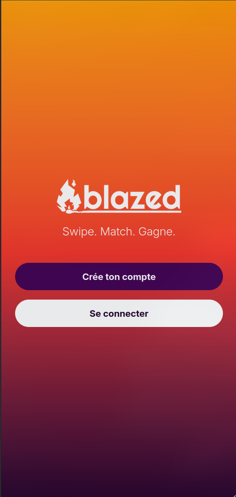

# Blazed

Blazed est une application de matching entre les freelances et entreprises autour des missions et des profils, prêts à faire flamber le marché?

## 📸 Aperçu




## 🌟 Fonctionnalités principales

- 🔐 Authentification sécurisée

- 📟 Formulaire multi-étapes pour inscription

- 💡 Système de matching intelligent basé sur les domaines et les intérêts

- 🎨 Interface moderne avec React et Tailwind

- ⚙️ API NestJS

- 🐳 Déploiement via Railway

## ⚙️ Installation locale

### Prérequis

- Node.js ≥ 18

- Docker

### 1. Cloner le projet

```bash

git  clone  https://github.com/Jupower38300/Blazed.git
cd  blazed

```

### 2. Lancer le backend

```bash

cd  back
cp  .env.example  .env
npm  install
npm  run  start:dev

```

### 3. Lancer le frontend

```bash

cd  ../front
npm  install
npm  run  dev

```

> Pour un environnement complet : `docker-compose up`

## 🔐 Variables d’environnement

> Un fichier `.env.example` est fourni dans le `back/`. Remplissez les secrets JWT, URLs, etc.

## 🧲 Tests

```bash

# Lancer les tests unitaires
cd  front
npm  run  test

```

## 🚧 Roadmap

- [x] Inscription multi-étapes pour freelances

- [x] Matching entreprise ↔ freelance

- [ ] Notifications en temps réel

- [ ] Back-office admin

- [ ] Tests end-to-end front avec Cypress

- [ ] Système de paiement intégré

## 🔒 Sécurité

- Hashage de mots de passe avec Argon2

- Authentification JWT + Refresh Token

- Rôles utilisateurs via AccessControl (guest, user, admin)

- Validation backend avec Zod

## 📄 Licence

Projet personnel – Tous droits réservés.

Utilisation autorisée uniquement avec accord explicite.

## 👤 Auteur

**Julien Legrand**
